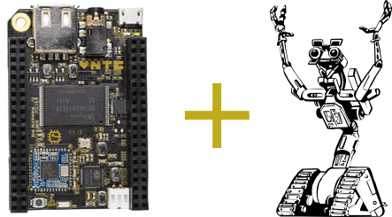

# chip-io



[Johnny-Five](https://github.com/rwaldron/johnny-five) [IO Plugin](https://github.com/rwaldron/io-plugins) for the [Next Thing Co.](http://nextthing.co/index.html) [C.H.I.P.](http://getchip.com)

## Prerequisites

 * Next Thing Co. [C.H.I.P.](http://getchip.com) board
 * Node.js installed
   1. Install ```curl```: ```sudo apt-get install curl```
   2. Follow Debian section of [NodeSource installations instructions](https://github.com/nodesource/distributions#debinstall)
 * Build essential installed: ```sudo apt-get install build-essential```
 * Add ```chip``` user to ```i2c``` group: ```sudo adduser chip i2c```

__NOTE:__ Some GPIO pins require `root` or `sudo`.

## Getting Started

```sh
npm install chip-io johnny-five
```

__NOTE:__ Must be run on the C.H.I.P. itself.

## Boilerplate Program

```javascript
var five = require('johnny-five');
var chipio = require('chip-io');

var board = new five.Board({
  io: new chipio()
});

board.on('ready', function() {
  // do Johnny-Five stuff
});
```

## Examples

See [examples](examples) folder as well as [Johnny-Five examples](http://johnny-five.io/examples/).

## API

See  [Johnny-Five API docs](http://johnny-five.io/api/).

## Pin Guide

| Johnny-Five Compatible Name | Number | Supported Modes | Requires root or sudo | Info |
| --------------------------- | :----: | --------------- | :-------------------: | ---- |
| LCD-D2 | 17 | Input | ✓ |  |
| PWM0 | 18 | Input, Output, PWM | ✓ |  |
| LCD-D4 | 19 | Input, Output | ✓ |  |
| LCD-D3 | 20 | Input, Output | ✓ |  |
| LCD-D6 | 21 | Input, Output | ✓ |  |
| LCD-D5 | 22 | Input, Output | ✓ |  |
| LCD-D10 | 23 | Input, Output | ✓ |  |
| LCD-D7 | 24 | Input, Output | ✓ |  |
| LCD-D12 | 25 | Input, Output | ✓ |  |
| LCD-D11 | 26 | Input, Output | ✓ |  |
| LCD-D14 | 27 | Input, Output | ✓ |  |
| LCD-D13 | 28 | Input, Output | ✓ |  |
| LCD-D18 | 29 | Input, Output | ✓ |  |
| LCD-D15 | 30 | Input, Output | ✓ |  |
| LCD-D20 | 31 | Input, Output | ✓ |  |
| LCD-D19 | 32 | Input, Output | ✓ |  |
| LCD-D22 | 33 | Input, Output | ✓ |  |
| LCD-D21 | 34 | Input, Output | ✓ |  |
| LCD-CLK | 35 | Input, Output | ✓ |  |
| LCD-D23 | 36 | Input, Output | ✓ |  |
| LCD-VSYNC | 37 | Input, Output | ✓ |  |
| LCD-HSYNC | 38 | Input, Output | ✓ |  |
| LCD-DE | 40 | Input, Output | ✓ |  |
| LRADC | 51 | Analog | ✓ |  |
| XIO-P0 | 53 | Input, Output |  | Connected to the built-in PCF8574A IO extender |
| XIO-P1 | 54 | Input, Output |  | Connected to the built-in PCF8574A IO extender |
| XIO-P2 | 55 | Input, Output |  | Connected to the built-in PCF8574A IO extender |
| XIO-P3 | 56 | Input, Output |  | Connected to the built-in PCF8574A IO extender |
| XIO-P4 | 57 | Input, Output |  | Connected to the built-in PCF8574A IO extender |
| XIO-P5 | 58 | Input, Output |  | Connected to the built-in PCF8574A IO extender |
| XIO-P6 | 59 | Input, Output |  | Connected to the built-in PCF8574A IO extender |
| XIO-P7 | 60 | Input, Output |  | Connected to the built-in PCF8574A IO extender |
| CSIPCK | 67 | Input | ✓ |  |
| CSICK | 68 | Input | ✓ |  |
| CSIHSYNC | 69 | Input | ✓ |  |
| CSIVSYNC | 70 | Input, Output | ✓ |  |
| CSID0 | 71 | Input, Output | ✓ |  |
| CSID1 | 72 | Input, Output | ✓ |  |
| CSID2 | 73 | Input, Output | ✓ |  |
| CSID3 | 74 | Input, Output | ✓ |  |
| CSID4 | 75 | Input, Output | ✓ |  |
| CSID5 | 76 | Input, Output | ✓ |  |
| CSID6 | 77 | Input, Output | ✓ |  |
| CSID7 | 78 | Input, Output | ✓ |  |
| I2C | | I2C | | Uses I2C port 2 (TWI2-SCK and TWI2-SDA). Address 0x38 is used by the built-in PCF8574A IO extender |


## Additional Features

| Type | Usage | Johnny-Five type | Notes |
| ---- | ----- | ---------------- | ----- |
| Battery Voltage | `new chipio.BatteryVoltage();` | [five.Sensor](http://johnny-five.io/api/sensor/) | Reads battery voltage from the AXP290 |
| Internal Temperature | `new chipio.InternalTemperature();` | [five.Thermometer](http://johnny-five.io/api/thermometer/) | Reads internal temperature from the AXP290 |
| Onboard Button | `new chipio.OnboardButton();` | [five.Button](http://johnny-five.io/api/button/) | Use onboard button (beside `LCD-DE` pin) connected to the AXP290 |
| Status LED | `new chipio.StatusLed;` | [five.Led](http://johnny-five.io/api/led/) | Controls status LED connected to GPIO2 on the AXP290 |
